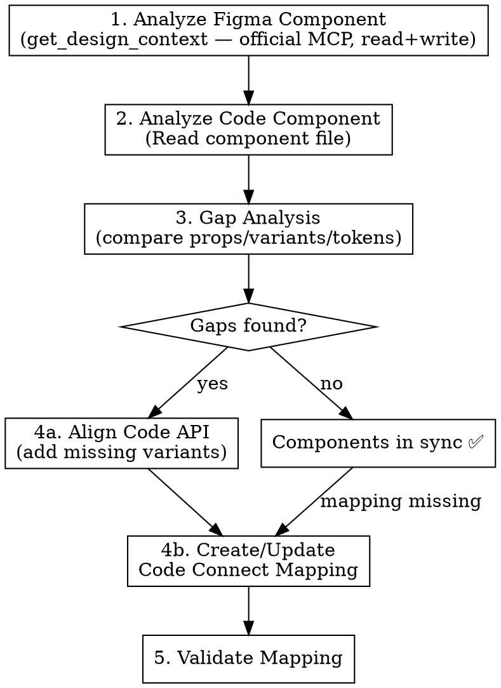
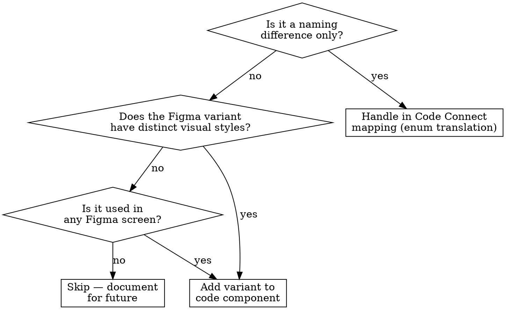

# Figma Design-Code Sync

## Overview

Maintains alignment between Figma design system components and their code counterparts. Detects prop/variant drift, generates Code Connect mappings, and reconciles API differences — so design changes propagate to code and vice versa.

**Core principle:** Figma components and code components must share a common vocabulary (props, variants, tokens). When they diverge, bugs and design inconsistencies follow. This skill bridges that gap.

## When to Use

- Designer changed a Figma component and you need to update code
- New variants added in Figma that don't exist in code (or vice versa)
- Setting up Code Connect mappings for the first time on existing components
- Component looks different in production vs Figma
- Periodic design system audit (quarterly sync check)

**When NOT to use:**
- Initial Code Connect installation → use `figma-setup`
- Converting a full Figma screen to code → use `figma-to-code`
- Creating new components from scratch (no Figma reference)

## Related Skills

| Skill | Direction | When to use instead |
|-------|-----------|---------------------|
| `figma-setup` | — | Initial Code Connect installation |
| `figma-to-code` | Figma → Code | Converting a full screen to code |
| `figma-designer` | Claude → Figma | Creating new screens/prototypes in Figma |
| `figma-design-system` | Code → Figma | Managing tokens, auditing DS, pushing code changes to Figma |

This skill handles the **mapping layer** between the two worlds. The others handle creation in one direction.

## Quick Reference

### Figma MCP (official — read + write)

| Tool | Purpose |
|---|---|
| `get_design_context(fileKey, nodeId)` | Extract component code + screenshot + props |
| `get_screenshot(fileKey, nodeId)` | Visual snapshot for comparison |
| `get_metadata(fileKey, nodeId)` | XML structure of a node/page |
| `get_variable_defs(fileKey)` | Design tokens and variables |
| `get_code_connect_map(fileKey)` | Existing Code Connect mappings |
| `get_code_connect_suggestions(fileKey)` | **New** — AI suggestions for Code Connect mappings |
| `add_code_connect_map(fileKey, ...)` | Create/update a CC mapping |
| `send_code_connect_mappings(fileKey, ...)` | Push mappings to Figma |
| `search_design_system(query, fileKey)` | Find components across all libraries |
| `use_figma(fileKey, code, description)` | Execute Plugin API code (create, modify, delete nodes) |

### Code Connect API

| API | Maps to |
|---|---|
| `figma.string("Prop")` | Text props |
| `figma.boolean("Prop")` | Toggle props |
| `figma.enum("Prop", { ... })` | Variant/select props |
| `figma.instance("Slot")` | Nested component slots (icons, etc.) |
| `figma.children("Content")` | Children/content areas |

## Core Workflow



### Step 1 — Analyze Figma Component

Call `get_design_context` with the component's nodeId and fileKey. Extract:

| Extract | Where to find it |
|---|---|
| **Props** | Component properties in the generated code (`type ButtonProps = { ... }`) |
| **Variants** | Enum values (e.g., `type?: "primary" \| "secondary"`) |
| **Sizes** | Size enum values |
| **Tokens** | CSS variables referenced (e.g., `var(--brand-primary)`) |
| **States** | Interactive states (hover, disabled, pressed) |

**Save the screenshot** — you'll use it for visual comparison later.

### Step 2 — Analyze Code Component

Read the existing code component. Extract the same information:

```
Props interface → variant names, size names, boolean flags
CVA/className logic → which visual styles map to which variant
Exported types → public API surface
```

### Step 3 — Gap Analysis

Build a comparison table:

```markdown
| Aspect | Figma | Code | Status |
|--------|-------|------|--------|
| Variant: primary | ✅ type="primary" | ✅ variant="default" | ⚠️ Name mismatch |
| Variant: secondary | ✅ type="secondary" | ✅ variant="outline" | ⚠️ Name mismatch |
| Variant: brand-primary | ✅ type="Brand primary" | ❌ missing | 🔴 Gap |
| Size: small | ✅ size="small" | ✅ size="sm" | ✅ Mapped |
| Size: medium | ✅ size="medium" | ✅ size="default" | ✅ Mapped |
| Size: large | ✅ size="large" | ✅ size="lg" | ✅ Mapped |
| Color type: wired | ✅ colorType="wired" | ❌ missing | 🔴 Gap |
| Icon left/right | ✅ iconLeft, iconRight | ❌ not handled | 🔴 Gap |
| Token: brand-primary | #404AFF | accentBlue | ✅ Value match |
```

**Gap categories:**
- **🔴 Gap** — Exists in Figma but not in code (or vice versa). Requires code changes.
- **⚠️ Name mismatch** — Same concept, different naming. Requires mapping only.
- **✅ Mapped** — Aligned or mappable without code changes.

### Step 4a — Align Code API (if gaps found)

When Figma has variants/props that code doesn't support, the code component needs updating BEFORE creating mappings.

**Decision framework:**



**When adding variants to code**, follow the existing pattern:
- If code uses `cva` → add to the variants object
- If code uses styled-components → add variant prop + styles
- If code uses plain CSS → add className mapping

### Step 4b — Create/Update Code Connect Mapping

Create a `.figma.tsx` file next to the component:

```tsx
// components/ui/Button.figma.tsx
import figma from "@figma/code-connect";
import { Button } from "./Button";

figma.connect(Button, "FIGMA_COMPONENT_URL", {
  props: {
    // Enum mapping — Figma names → code values
    variant: figma.enum("type", {
      "Brand primary": "brand-primary",
      "Brand secondary": "brand-secondary",
      "primary": "primary",
      "secondary": "secondary",
      "tertiary": "tertiary",
      "light_black": "light-black",
      "light_white": "light-white",
    }),
    // Enum mapping — sizes
    size: figma.enum("size", {
      "small": "sm",
      "medium": "md",
      "large": "lg",
    }),
    // Boolean props
    colorType: figma.enum("colorType", {
      "full": "full",
      "wired": "outline",
    }),
    // Instance slots (icons)
    iconLeft: figma.instance("Icon Left"),
    iconRight: figma.instance("Icon Right"),
    // Text content
    label: figma.string("Label"),
  },
  example: (props) => (
    <Button
      variant={props.variant}
      size={props.size}
      colorType={props.colorType}
      iconLeft={props.iconLeft}
      iconRight={props.iconRight}
    >
      {props.label}
    </Button>
  ),
});
```

### Step 5 — Validate

1. Run `npx figma connect verify` to check mapping syntax
2. Compare Figma screenshot with rendered component
3. Verify all Figma variants produce correct visual output in code

## Mapping Patterns

### Enum Translation (most common)

Figma and code use different names for the same concept:

```tsx
// Figma: "Brand primary", "Brand secondary"
// Code: "brand-primary", "brand-secondary"
variant: figma.enum("type", {
  "Brand primary": "brand-primary",
  "Brand secondary": "brand-secondary",
})
```

### Boolean to Variant

Figma uses a boolean toggle, code uses a variant string:

```tsx
// Figma: filled=true/false
// Code: variant="filled" | "outlined"
variant: figma.boolean("filled", {
  true: "filled",
  false: "outlined",
})
```

### Compound Variants

Figma has two props that combine into one code prop:

```tsx
// Figma: type="primary" + colorType="wired"
// Code: variant="primary-outline"
// → Handle in the example function
example: (props) => {
  const variant = props.colorType === "outline"
    ? `${props.type}-outline`
    : props.type;
  return <Button variant={variant} />;
}
```

### Instance Slots (Icons)

Figma component has swappable icon instances:

```tsx
// Figma: "Icon Left" instance swap
iconLeft: figma.instance("Icon Left"),

// In example, render conditionally
example: (props) => (
  <Button>
    {props.iconLeft}
    {props.label}
  </Button>
)
```

### Nested Components

Figma component contains other mapped components:

```tsx
// Figma: Card contains a Button child
children: figma.children("Content"),

example: (props) => (
  <Card>
    {props.children}
  </Card>
)
```

## Batch Sync Mode

Scan all components in the project, detect missing mappings, and generate all `.figma.tsx` files in one pass.

**Trigger:** User says "sync all components", "generate all mappings", "batch sync", or "scan all my components".

### Step 1 — Inventory

Scan 3 sources and cross-reference:

```bash
# Code components
Glob: src/components/ui/*.tsx (exclude *.figma.tsx, *.test.tsx, *.stories.tsx)

# Existing mappings
Glob: src/components/**/*.figma.tsx

# Figma components (via official MCP)
search_design_system → all components across libraries
```

Present the coverage table:

```markdown
## Batch Sync Inventory

**Figma file:** [name]
**Components dir:** src/components/ui/

| Code Component | .figma.tsx | Figma Match | Status |
|----------------|-----------|-------------|--------|
| Button.tsx | ✅ exists | ✅ "Button" | ✅ Mapped |
| Card.tsx | ❌ missing | ✅ "Card" | 🔴 Needs mapping |
| Input.tsx | ❌ missing | ✅ "Input" | 🔴 Needs mapping |
| Badge.tsx | ❌ missing | ❌ not found | ⚠️ No Figma counterpart |
| Dialog.tsx | ✅ exists | ✅ "Dialog" | 🔄 Check freshness |
| — | — | ✅ "Avatar" | ⚠️ Figma only (no code) |

**Coverage:** 2/6 mapped (33%)
**To generate:** 2 new .figma.tsx files
**Figma-only:** 1 component (no code counterpart)
**Code-only:** 1 component (no Figma counterpart)
```

**STOP** — User validates which components to sync before proceeding.

### Step 2 — Batch Generate

For each component marked "Needs mapping", run the core workflow (Steps 1-4b) automatically:

```
For each unmapped component:
  1. get_design_context(nodeId, fileKey) → read Figma component
  2. Read src/components/ui/[Name].tsx → read code component
  3. Gap analysis → compare props/variants
  4. Generate src/components/ui/[Name].figma.tsx
  5. Log result
```

**Important rules for batch mode:**
- Do NOT modify code components in batch mode — only generate `.figma.tsx` files
- If a gap requires code changes (🔴 Gap), flag it in the report and skip mapping
- If Figma component has no clear match, skip and flag
- Generate mappings with `// TODO: verify` comments for any uncertain enum translations

### Step 3 — Publish All

```bash
npx figma connect publish
```

### Step 4 — Batch Report

```markdown
## Batch Sync Report

**Date:** [date]
**Figma file:** [name]

### Coverage
| Metric | Before | After |
|--------|--------|-------|
| Total components | [N] | [N] |
| Mapped (.figma.tsx) | [N] | [N] |
| Coverage | [X]% | [Y]% |

### Generated Mappings
| Component | Props Mapped | Gaps Found | Status |
|-----------|-------------|------------|--------|
| Card | 4/4 | 0 | ✅ Clean |
| Input | 3/5 | 2 | ⚠️ Has TODOs |

### Skipped (needs manual attention)
| Component | Reason |
|-----------|--------|
| Badge | No Figma counterpart |
| Input.size | Figma has "xl" size, code doesn't — add variant first |

### Next Steps
- [ ] Fix [N] gaps flagged above (code changes needed)
- [ ] Review generated .figma.tsx files with `// TODO: verify`
- [ ] Run `npx figma connect verify` to validate
- [ ] Consider creating Figma components for code-only items
```

**STOP** — User reviews report, then optionally chains to fix gaps.

---

## Drift Detection Checklist

Run this periodically (or when a designer flags a discrepancy):

```markdown
### Design-Code Sync Audit

**Component:** [Name]
**Figma URL:** [URL]
**Code path:** [path]
**Last synced:** [date]

| Check | Status |
|-------|--------|
| All Figma variants exist in code | ✅/❌ |
| All code variants exist in Figma | ✅/❌ |
| Size values match | ✅/❌ |
| Color tokens aligned | ✅/❌ |
| Typography tokens aligned | ✅/❌ |
| Spacing tokens aligned | ✅/❌ |
| Interactive states match | ✅/❌ |
| Code Connect mapping exists | ✅/❌ |
| Code Connect mapping is current | ✅/❌ |

**Drift score:** X/9
- 9/9: Perfectly synced
- 7-8: Minor drift, mapping update needed
- 4-6: Significant drift, code changes likely needed
- <4: Major redesign or new component needed
```

## Common Mistakes

| Mistake | Fix |
|---------|-----|
| Mapping props that don't exist in code | Align code API first, THEN create mapping |
| Hardcoding Figma hex values instead of using tokens | Map Figma variables → CSS custom properties |
| Creating 1:1 mapping for compound variants | Use the `example` function to compose |
| Ignoring Figma states (hover, disabled, pressed) | Map states to code interactive styles |
| Not updating mapping after code refactor | Add mapping verification to PR review checklist |
| Mapping visual-only Figma variants (e.g. dark mode preview) | Only map props that represent real component API |

## Process Output Template

After completing a sync for a component, produce:

```markdown
## Figma ↔ Code Sync Report: [ComponentName]

**Date:** [date]
**Figma:** [URL]
**Code:** [file path]

### Gap Analysis Summary
- 🔴 Gaps resolved: [N]
- ⚠️ Name mismatches mapped: [N]
- ✅ Already aligned: [N]

### Changes Made
**Code:** [list of variant/prop additions]
**Mapping:** [.figma.tsx created/updated]
**Tokens:** [any token alignments]

### Remaining TODOs
- [ ] [if any gaps were deferred]
```

## CI Workflow: Automated Mapping Verification

Add to your CI pipeline to catch drift automatically.

### GitHub Action

```yaml
# .github/workflows/figma-sync-check.yml
name: Figma Code Connect Verify

on:
  pull_request:
    paths:
      - 'src/components/**'
      - '**/*.figma.tsx'

jobs:
  verify-mappings:
    runs-on: ubuntu-latest
    steps:
      - uses: actions/checkout@v4

      - uses: actions/setup-node@v4
        with:
          node-version: '20'

      - run: npm ci

      - name: Verify Code Connect mappings
        run: npx figma connect verify
        env:
          FIGMA_ACCESS_TOKEN: ${{ secrets.FIGMA_ACCESS_TOKEN }}

      - name: Check for unmapped components
        run: |
          # Find components without .figma.tsx files
          COMPONENTS=$(find src/components/ui -name "*.tsx" ! -name "*.figma.tsx" ! -name "*.test.tsx" ! -name "*.stories.tsx" | sort)
          MAPPINGS=$(find src/components -name "*.figma.tsx" | sed 's/.figma.tsx/.tsx/' | sort)
          UNMAPPED=$(comm -23 <(echo "$COMPONENTS") <(echo "$MAPPINGS"))
          if [ -n "$UNMAPPED" ]; then
            echo "::warning::Components without Figma mappings:"
            echo "$UNMAPPED"
          fi
```

### Pre-commit Hook

```bash
#!/bin/bash
# .git/hooks/pre-commit (or via .claude/templates/git-hooks/)

# Check if any component files changed
CHANGED_COMPONENTS=$(git diff --cached --name-only | grep -E 'src/components/.*\.tsx$' | grep -v '.figma.tsx' | grep -v '.test.tsx')

if [ -n "$CHANGED_COMPONENTS" ]; then
  echo "Component files changed — checking Code Connect mappings..."
  for comp in $CHANGED_COMPONENTS; do
    mapping="${comp%.tsx}.figma.tsx"
    if [ ! -f "$mapping" ]; then
      echo "⚠️  No .figma.tsx mapping for: $comp"
    fi
  done
fi
```

### Periodic Audit Script

```bash
#!/bin/bash
# scripts/figma-audit.sh — run quarterly or after major DS changes

echo "=== Figma Design-Code Sync Audit ==="
echo "Date: $(date)"

# Count components vs mappings
TOTAL=$(find src/components/ui -name "*.tsx" ! -name "*.figma.tsx" ! -name "*.test.tsx" ! -name "*.stories.tsx" | wc -l)
MAPPED=$(find src/components -name "*.figma.tsx" | wc -l)
echo "Components: $TOTAL | Mapped: $MAPPED | Coverage: $(( MAPPED * 100 / TOTAL ))%"

# Verify existing mappings
echo ""
echo "Verifying mappings..."
npx figma connect verify 2>&1

echo ""
echo "Run '/figma-design-code-sync' in Claude to fix any issues."
```

## Auto-Chain

After sync is complete:
- → `figma-design-system` — If tokens need updating in Figma (code→Figma direction)
- → `figma-designer` — If new component needs to be created in Figma
- → `/code-reviewer` — Review any code changes made during sync
- → `/test-runner` — Test modified components
