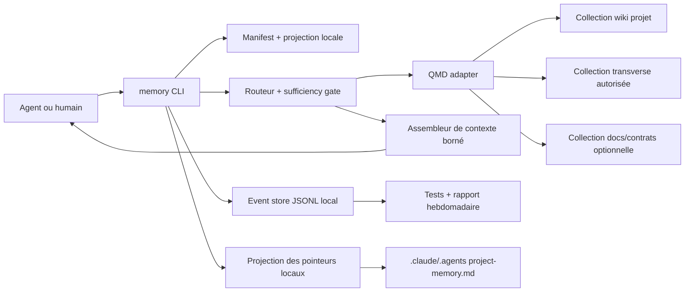
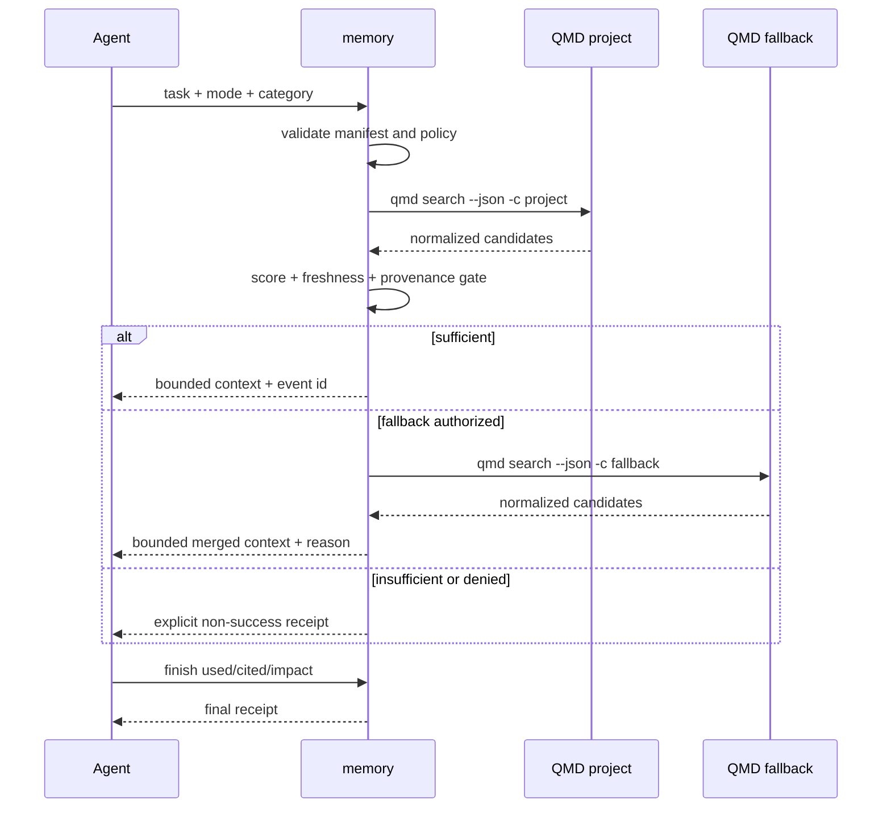

# Architecture — Observable second-brain efficiency

## 1. Résumé de la solution

La V1 ajoute au skill `llm-wiki` un plan de contrôle local nommé `memory`.
Il ne remplace ni Obsidian, ni Git, ni QMD : il transforme une tâche en route de
récupération bornée, applique les politiques du projet, assemble un contexte
mesuré, puis produit des événements metadata-only.

```text
Git + Markdown       = connaissance durable et gouvernance
Repo courant         = vérité immédiate du code et des contrats
QMD                  = recherche locale dans les collections autorisées
memory (Python)      = politique, budgets, reçus, mesure et diagnostics
Agent / humain       = jugement, attestation d'usage et arbitrage du sens
```

La V1 reste un outil CLI Python sans service hébergé, sans base distante, sans
index complet du code et sans dépendance obligatoire à Graphify. Elle complète
le brownfield actuel au lieu de créer une seconde plateforme mémoire.

## 2. Contexte brownfield confirmé

### 2.1 Éléments réutilisés

- `.claude/skills/llm-wiki/` est la source canonique du produit mémoire.
- Les scripts existants utilisent `argparse`, `pathlib`, la bibliothèque
  standard Python et des sorties humain/JSON.
- `install.sh` synchronise d'abord `~/.claude/`, puis crée les miroirs Claude,
  Codex, Gemini et OpenCode. Les installations provider-only réutilisent déjà
  `~/.claude/` comme source locale.
- `scripts/create-project-memory-pointer.sh` sait générer les deux pointeurs
  locaux et les protéger via `.git/info/exclude`.
- QMD 0.9.0 fournit `search`, `vsearch`, `query`, `get`, les collections et une
  sortie JSON pour les recherches.
- Les fixtures de `.claude/skills/llm-wiki/expected_outputs/` constituent un
  précédent pour les contrats CLI testables.

### 2.2 Dettes à corriger dans le même chantier

- Le workflow canonique `query-workflow.md` impose encore `index.md` puis 3 à
  10 pages avant la recherche ; le nouveau contrat doit devenir task-first.
- Les pointeurs actuels mélangent données locales et instructions de routage.
- L'installation ne publie pas encore d'exécutable provider-neutral.
- Il n'existe ni suite de tests Python automatisée, ni schéma d'événement, ni
  mesure des contextes mémoire.
- Le statut QMD est aujourd'hui consommé sous forme humaine ; cette dépendance
  doit rester enfermée dans un adapter versionné.

## 3. Drivers et contraintes

| Driver | Conséquence d'architecture |
|---|---|
| Réduire le contexte sans perdre en qualité | Budgets souples + gate qualité couplé aux golden questions. |
| Mini-cerveaux partagés par Git | Contrat portable versionné, projection locale ignorée. |
| Compatibilité multi-agent | CLI autonome et sorties JSON stables, sans SDK provider. |
| Confidentialité | Aucune requête ni réponse dans les événements ; recherche lexicale par défaut. |
| Maintenance <= 10 min/semaine | Événements append-only et rapport plafonné à 7 arbitrages. |
| Brownfield stdlib | Python 3.10+ standard library ; QMD appelé comme processus. |
| QMD optionnel | Dégradation bornée sur pages d'entrée pour `minimal/project`. |
| Repo vérité immédiate | Une contradiction ne réécrit jamais automatiquement le wiki. |

## 4. Décisions d'architecture

| ID | Décision | Motif | Alternative écartée |
|---|---|---|---|
| ADR-001 | Étendre `llm-wiki` plutôt que créer un package séparé. | Conserve la source de vérité et l'installation existantes. | Nouveau repo/service mémoire. |
| ADR-002 | Python 3.10+ et bibliothèque standard en V1. | Portabilité, démarrage rapide, cohérence brownfield. | Framework CLI et ORM. |
| ADR-003 | `.agents/memory.yaml` utilise le sous-ensemble YAML 1.2 compatible JSON. | `json` permet un parseur sûr et déterministe sans PyYAML. | Parseur YAML maison ou dépendance obligatoire. |
| ADR-004 | Configuration partagée et projection machine sont séparées. | Aucun chemin absolu committé ; onboarding reproductible. | Pointeur Markdown comme unique config. |
| ADR-005 | QMD est appelé avec `subprocess.run([...], shell=False)`. | Isolation du moteur, timeout, test avec faux binaire. | SDK Node/Bun embarqué ou shell interpolé. |
| ADR-006 | `qmd search` BM25 est le retrieval par défaut V1. | QMD 0.9.0 ne persiste pas la requête sur ce chemin. | `query` ou `vsearch` systématique. |
| ADR-007 | Le sémantique profond est `explicit`, jamais implicite. | `vsearch` et `query` 0.9.0 développent la requête et utilisent `llm_cache`. | Promesse de confidentialité contredite par le runtime. |
| ADR-008 | Gate de suffisance déterministe ; ambiguïté rendue à l'agent. | Aucun appel LLM additionnel caché ; comportement testable. | Auto-évaluateur provider-couplé dans le CLI. |
| ADR-009 | Télémétrie JSONL locale, append-only, événements immuables. | Audit simple, purge facile, aucune base distante. | SQLite produit ou SaaS analytics. |
| ADR-010 | Estimateur `utf8_bytes_div_4_v1`, comparatif et conservateur. | Zéro dépendance ; même règle pour baseline et variante. | Présenter une estimation comme facture provider exacte. |
| ADR-011 | Collections par niveau de confiance, pas code dans le vault. | Sépare mémoire durable, contrats courants et artefacts jetables. | Indexer le repo complet dans Obsidian. |
| ADR-012 | `skillz-memory` est le binaire sans collision ; `memory` est l'alias nominal. | Préserve l'UX tout en évitant d'écraser un binaire existant. | Écrasement silencieux de `memory`. |

### 4.1 Limite assumée sur le YAML

Le fichier reste nommé `.agents/memory.yaml`, conformément au contrat produit,
mais sa syntaxe V1 est le sous-ensemble JSON de YAML 1.2 : accolades, tableaux,
chaînes entre guillemets, booléens et nombres JSON. Cette règle est moins
agréable qu'un YAML libre, mais elle évite trois risques : exécution de tags
YAML, divergences de parseur entre agents et installation d'une dépendance.

`memory doctor` doit retourner une erreur explicite si le fichier utilise une
syntaxe YAML non supportée. Un adapter PyYAML optionnel pourra être ajouté plus
tard sans modifier le schéma logique ni `schema_version`.

## 5. Vue composants



### 5.1 Modules proposés

```text
.claude/skills/llm-wiki/
├── bin/
│   └── memory                     # wrapper shell minimal
├── memory_cli/
│   ├── __init__.py
│   ├── __main__.py
│   ├── cli.py                     # argparse et dispatch
│   ├── contracts.py               # dataclasses, enums, schema_version
│   ├── manifest.py                # découverte, parsing, validation
│   ├── projection.py              # config locale + pointeurs ignorés
│   ├── routing.py                 # routes, modes, politiques
│   ├── sufficiency.py             # règles pures et explicables
│   ├── qmd_adapter.py             # processus QMD et normalisation
│   ├── context.py                 # sélection de sections + budgets
│   ├── tokens.py                  # estimateurs versionnés
│   ├── freshness.py               # page, Git local, QMD
│   ├── events.py                  # append, lecture, rétention
│   ├── receipts.py                # modèles de sortie indépendants
│   ├── doctor.py                  # checks et actions correctives
│   ├── golden.py                  # cas, runs, gate composite
│   ├── report.py                  # agrégats metadata-only
│   ├── render_human.py            # TTY / NO_COLOR
│   └── render_json.py             # contrat machine
├── scripts/
│   └── memory.py                  # entrypoint Python de compatibilité
├── tests/
│   ├── unit/
│   ├── contract/
│   ├── integration/
│   └── fixtures/
└── expected_outputs/
    └── memory/
```

Les modules métier ne dépendent ni d'`argparse`, ni des couleurs, ni du
processus QMD. `cli.py` convertit les arguments en dataclasses puis rend un
résultat via `render_human` ou `render_json`.

## 6. Contrats de configuration

### 6.1 Manifeste partagé `.agents/memory.yaml`

Exemple Skillz-Claude minimal :

```json
{
  "schema_version": 1,
  "project": {
    "id": "skillz-claude",
    "name": "Skillz-Claude",
    "owner": "Aymeric"
  },
  "stores": {
    "project": {
      "remote": "https://github.com/elsolal/elsolal-memory.git",
      "collection": "elsolal-wiki",
      "entry_pages": [
        "wiki/entities/skillz-claude.md",
        "wiki/concepts/project-memory-workflow.md"
      ]
    }
  },
  "fallbacks": [],
  "budgets": {
    "minimal": {"target_tokens": 800, "hard_tokens": 1200},
    "project": {"target_tokens": 2500, "hard_tokens": 4000},
    "historical": {"target_tokens": 6000, "hard_tokens": 9000}
  },
  "policy": {
    "semantic_retrieval": "explicit",
    "full_index_fallback": true,
    "retention_days": 30
  },
  "golden": {
    "visible_path": ".agents/memory/golden.json",
    "quality_rubric": ".agents/memory/quality-rubric.json"
  }
}
```

Pour Pleepole-back, `stores.project.collection` vaut `pleepole-wiki` et un
fallback transverse peut être déclaré ainsi :

```json
{
  "id": "transverse",
  "collection": "elsolal-wiki",
  "allowed_roles": ["owner"],
  "task_categories": ["architecture", "operations", "historical"],
  "entry_pages": ["wiki/concepts/project-memory-workflow.md"]
}
```

Le manifeste n'accepte ni commande arbitraire, ni variable shell, ni chemin
absolu. Les IDs projet/collection suivent `^[a-z0-9][a-z0-9-]{1,62}$`.

### 6.2 Projection locale `.agents/memory.local.json`

Fichier ignoré par Git et créé avec permissions utilisateur :

```json
{
  "schema_version": 1,
  "principal": {"role": "owner"},
  "stores": {
    "project": {
      "root": "/Users/aymeric/Documents/Obsidian-Elsolal/Elsolal"
    }
  }
}
```

La projection sert uniquement à résoudre les racines locales. Les autorisations
du manifeste restent nécessaires ; déclarer localement `owner` ne donne aucun
accès filesystem ou Git supplémentaire.

`memory configure` génère en une transaction logique :

1. `.agents/memory.local.json` ;
2. `.claude/project-memory.md` ;
3. `.agents/project-memory.md` ;
4. les entrées `.git/info/exclude` nécessaires.

Le module `projection.py` devient la source de vérité de cette génération. Le
script shell existant reste un wrapper de compatibilité pendant la migration.

### 6.3 Profil docs et contrats

Une source P1 peut être ajoutée sans déplacer son contenu dans Obsidian :

```json
{
  "id": "repository-contracts",
  "kind": "qmd",
  "trust": "current_contract",
  "collection": "pleepole-back-contracts",
  "include": ["docs/**/*.md", "openapi/**/*.yaml", "supabase/**/*.sql"],
  "exclude": ["**/.env*", "**/*secret*", "**/logs/**", "**/dist/**"]
}
```

Ce profil est une collection séparée, régénérable, dont le repo reste la source
de vérité. Les extensions de code applicatif sont refusées par défaut en V1.

## 7. Commandes publiques

| Commande | Responsabilité | Mutation |
|---|---|---|
| `memory configure` | Créer la projection locale et les pointeurs. | Locale, jamais committée. |
| `memory doctor` | Vérifier manifeste, projection, pages, QMD, Git et fraîcheur. | Aucune par défaut. |
| `memory context` | Récupérer et émettre un contexte borné. | Événement local. |
| `memory finish` | Ajouter usage/citations/impact attestés à un événement. | Événement local append-only. |
| `memory test` | Exécuter golden/holdout et calculer les dimensions disponibles. | Run local metadata-only. |
| `memory report --weekly` | Produire agrégats et sept arbitrages maximum. | Markdown filtré sur demande. |
| `memory purge` | Appliquer ou forcer la rétention locale. | Supprime uniquement la télémétrie locale. |

### 7.1 Entrée de requête

`memory context` accepte la requête via argument ou stdin. Stdin est recommandé
pour les tâches sensibles afin d'éviter l'historique shell et la visibilité
temporaire dans la liste des processus.

```bash
memory context --mode project --task-category architecture --query-stdin
memory context --mode minimal --task-category bug "timeout invitation"
```

La catégorie est obligatoire en non-TTY et appartient à :

```text
bug, architecture, product, operations, security,
data, historical, onboarding, general
```

La requête vit uniquement en mémoire du processus et dans le processus QMD. Elle
n'est incluse ni dans l'événement, ni dans le reçu final, ni dans le rapport.

### 7.2 Taxonomie d'exit codes

| Code | Sens |
|---:|---|
| 0 | Succès utilisable. |
| 2 | Usage CLI invalide. |
| 10 | Dégradé mais utilisable (`minimal/project`). |
| 20 | Contexte insuffisant. |
| 21 | Conflit à arbitrage humain. |
| 30 | Manifeste ou projection invalide. |
| 31 | Dépendance requise absente. |
| 32 | Route ou accès refusé par politique. |
| 33 | Fraîcheur bloquante. |
| 40 | Échec du moteur de retrieval ou timeout. |
| 50 | Intégrité télémétrie/contrat compromise. |

Une sortie `--json` est toujours produite quand le parseur d'arguments a réussi,
y compris pour les erreurs métier. stderr porte uniquement progression et
diagnostics ; stdout porte le résultat fonctionnel.

## 8. Routage et récupération

### 8.1 Enveloppes initiales

Ces valeurs sont des paramètres de départ à calibrer sur les 20 golden questions,
pas des seuils universels.

| Mode | Budget cible | Hard cap | Candidats max/route | Sections max | Sans QMD |
|---|---:|---:|---:|---:|---|
| `minimal` | 800 | 1 200 | 3 | 1 | 1 page d'entrée bornée |
| `project` | 2 500 | 4 000 | 8 | 3 | 3 pages d'entrée bornées |
| `historical` | 6 000 | 9 000 | 15 | 6 | Bloqué |

Le budget cible provoque l'arrêt normal. Le hard cap ne peut être dépassé
qu'avec `--risk-reason security|data|architecture|product|incident`, et ce
dépassement est visible dans l'événement et le reçu.

### 8.2 Pipeline nominal



### 8.3 Adapter QMD

Commande par défaut :

```text
qmd search <query> --json -c <collection> -n <limit> --min-score <score>
```

Contraintes :

- tableau d'arguments, jamais `shell=True` ;
- timeout par route, défaut 8 secondes, configurable jusqu'à 30 secondes ;
- taille stdout/stderr bornée ;
- parsing JSON strict puis conversion en `RetrievalHit` interne ;
- version QMD supportée initialement : `>=0.9.0,<1.0.0` ;
- fixtures contractuelles pour les sorties 0.9.x ;
- résultat vide, JSON invalide et timeout sont trois états distincts.

`qmd vsearch` et `qmd query` sont exclus de la route par défaut de la V1 : dans
QMD 0.9.0, ils développent la requête avec un modèle local et utilisent la table
`llm_cache`. Une politique `semantic_retrieval: explicit` peut autoriser une
expérience locale, mais elle doit afficher cette persistance potentielle et ne
participe pas au chemin de conformité par défaut.

### 8.4 Gate de suffisance V1

Le gate retourne `sufficient`, `insufficient`, `ambiguous` ou `blocked`, avec une
liste de reason codes. Les scores initiaux concernent la sortie normalisée de
`qmd search` 0.9.x.

| Règle | `minimal` | `project` | `historical` |
|---|---|---|---|
| Score candidat minimum | 0,70 | 0,55 | 0,45 |
| Suffisance forte | 1 hit >= 0,75 | 1 hit >= 0,75 | Non |
| Suffisance par couverture | Non | 2 hits >= 0,55 | 2 hits dont 1 source/synthesis |
| Fraîcheur bloquante | Selon catégorie à risque | Selon catégorie à risque | Toujours signalée |
| Provenance requise | Page valide | Page valide | Source ou synthèse sourcée |

Reason codes de fallback :

```text
no_result, below_score, insufficient_coverage, stale,
missing_provenance, task_requires_transverse, ambiguous
```

Une ambiguïté n'appelle pas un LLM caché. Le CLI renvoie les preuves à l'agent,
qui peut soit s'arrêter, soit relancer explicitement le fallback. La décision
est alors attestée et mesurable.

### 8.5 Assemblage de contexte

1. Dédupliquer par `collection + relative_path`.
2. Ordonner par confiance de source, score, fraîcheur, puis rang QMD.
3. Résoudre l'URI QMD via la racine de projection locale.
4. Rejeter tout chemin sortant de la racine après `Path.resolve()`.
5. À partir de la ligne du snippet, sélectionner la section Markdown courante.
6. Ajouter frontmatter utile, titre, plage de lignes et provenance.
7. Tronquer sur frontière de paragraphe avant le budget cible.
8. Ne charger une nouvelle section que si elle apporte une source ou catégorie
   encore absente.

`retrieved` contient tous les hits normalisés. `read` contient uniquement les
sections effectivement émises dans stdout. Le contexte complet n'est jamais
recopié dans la télémétrie.

### 8.6 Estimateur de tokens

```text
estimated_tokens = ceil(len(utf8_bytes) / 4)
estimator_version = "utf8_bytes_div_4_v1"
```

L'estimation est volontairement conservatrice pour le français accentué. Elle
sert à comparer la baseline et la nouvelle route avec la même règle. Les futurs
adapters provider pourront ajouter des compteurs réels sans remplacer la mesure
provider-neutral.

## 9. Fraîcheur et conflits

### 9.1 Fraîcheur

Le statut combine quatre preuves séparées :

| Preuve | Source | Check nominal |
|---|---|---|
| Page | frontmatter `updated`, sinon mtime | local |
| Vault Git | dernier commit local de la page | local |
| Remote Git | écart local/remote | `doctor --network` uniquement |
| QMD | collection présente + âge exposé par `qmd status` | adapter versionné |

Seuils initiaux : avertissement après 24 h d'écart Git connu ou index plus vieux
que le dernier commit ; blocage seulement pour `security`, `data`, `incident` ou
`historical` lorsque la preuve requise est indisponible. Un âge seul ne rend pas
une décision fausse : il produit d'abord un avertissement.

`doctor` n'effectue aucun `git fetch`, `qmd update`, `qmd embed` ou téléchargement
de modèle sans option explicite. `doctor --network` peut vérifier le remote sans
modifier les branches. `doctor --fix` reste limité aux projections locales ; il
ne réindexe pas silencieusement.

### 9.2 Conflits mémoire ↔ repo

- Le repo courant et les contrats exécutables ont priorité opérationnelle.
- Le conflit est classé `low`, `medium`, `high` selon catégorie et impact.
- `high` sur produit, architecture, sécurité ou données retourne exit 21.
- L'événement conserve docid, chemin relatif, type de preuve et niveau de risque,
  jamais le texte complet de la contradiction.
- `memory finish --conflict ...` peut préparer une dette ou un brouillon local ;
  aucune page partagée n'est modifiée automatiquement.

## 10. Télémétrie locale

### 10.1 Emplacement

Ordre de résolution :

1. `SKILLZ_MEMORY_STATE_DIR` si explicitement défini ;
2. `$XDG_STATE_HOME/skillz-memory` ;
3. `~/.local/state/skillz-memory` sur POSIX ;
4. `%LOCALAPPDATA%/skillz-memory` lors d'un futur support Windows.

Les répertoires sont créés en `0700` et les fichiers en `0600` quand la
plateforme le permet. Les fichiers sont mensuels :

```text
events/<project-id>/2026-07.jsonl
runs/<project-id>/<run-id>.json
```

### 10.2 Modèle append-only

Le contexte et l'attestation sont deux événements immuables reliés :

```json
{
  "schema_version": 1,
  "event_id": "mem_20260716T153012Z_a1b2c3",
  "event_type": "context_completed",
  "occurred_at": "2026-07-16T15:30:12Z",
  "project_id": "pleepole-back",
  "payload": {
    "mode": "project",
    "task_category": "architecture",
    "status": "sufficient",
    "route": ["pleepole-wiki"],
    "retrieved": [
      {"docid": "#a1b2c3", "collection": "pleepole-wiki", "path": "entities/pleepole-back.md", "score": 0.86}
    ],
    "read": ["#a1b2c3"],
    "estimated_context_tokens": 840,
    "estimator_version": "utf8_bytes_div_4_v1",
    "budget_tokens": 2500,
    "duration_ms": 1200,
    "fallback_reason": null,
    "risk_reason": null
  }
}
```

```json
{
  "schema_version": 1,
  "event_id": "att_20260716T153145Z_d4e5f6",
  "event_type": "usage_attested",
  "occurred_at": "2026-07-16T15:31:45Z",
  "project_id": "pleepole-back",
  "parent_event_id": "mem_20260716T153012Z_a1b2c3",
  "payload": {
    "used": ["#a1b2c3"],
    "cited": ["#a1b2c3"],
    "impact_codes": ["project_convention_applied"]
  }
}
```

Avant append, les docids `used/cited` doivent appartenir au `retrieved` parent.
L'écriture utilise un verrou de fichier portable isolé dans `events.py`, une
ligne JSON compacte et `fsync` pour la dernière ligne. Une dernière ligne
incomplète est signalée et ignorée par les lecteurs ; les lignes antérieures
restent exploitables.

### 10.3 Interdictions de données

Jamais dans les événements ou rapports :

- requête, prompt, réponse ou transcript ;
- snippet ou corps de page ;
- chemin absolu ;
- secret, valeur d'environnement ou argument de commande ;
- événement détaillé provenant d'un autre projet.

La rétention supprime les événements détaillés vieux de 30 jours. Les rapports
partagés sont recalculables, agrégés par projet et soumis à un scanner
metadata-only avant écriture.

## 11. Reçus et schéma JSON public

Chaque résultat JSON possède l'enveloppe :

```json
{
  "schema_version": 1,
  "command": "context",
  "status": "sufficient",
  "project_id": "pleepole-back",
  "event_id": "mem_...",
  "data": {},
  "warnings": [],
  "errors": []
}
```

Le rendu humain et le rendu JSON consomment exactement le même objet résultat.
Les tests contractuels vérifient l'ordre stable des sections humaines, la
présence de tous les champs fonctionnels sous `NO_COLOR=1`, et le fait que les
diagnostics ne polluent pas stdout.

## 12. Golden questions, holdouts et qualité

### 12.1 Fichiers

```text
.agents/memory/golden.json              # 8 cas visibles, versionnés
.agents/memory/quality-rubric.json       # rubrique versionnée
.agents/memory/holdout.local.json        # 2 cas locaux, ignorés
```

Le holdout local contient des tâches nettoyées et des pages/sources attendues.
Il ne contient aucun secret. Seul son résultat agrégé peut être partagé.

### 12.2 Ce que `memory test` automatise

- route utilisée et fallback ;
- présence de la page et de la source attendues ;
- contexte estimé et réduction vs baseline `index-first` ;
- fraîcheur et temps de récupération ;
- absence de données interdites dans événements/exports.

Le CLI ne prétend pas noter seul la qualité d'une réponse LLM. Une réponse
produite hors CLI est évaluée avec la rubrique versionnée, puis un score nettoyé
est importé via `memory test record-quality`. Le gate composite reste
`incomplete` tant que la dimension qualité n'est pas fournie.

Cette séparation évite qu'un outil mesure sa propre qualité avec le même signal
qu'il cherche à optimiser.

## 13. Rapports et gouvernance

`memory report --weekly` lit uniquement les événements du projet courant et
produit :

1. efficacité médiane et p95 ;
2. golden/holdout retrieval et qualité importée ;
3. taux de fallback et d'insuffisance ;
4. fraîcheur et erreurs d'activation ;
5. taux `retrieved -> read -> used -> cited` ;
6. sept arbitrages maximum, classés risque puis impact observé.

Chaque arbitrage accepte `fix`, `ignore --reason` ou
`snooze --until YYYY-MM-DD`. Le rapport Markdown ne contient que des agrégats,
des docids/chemins relatifs nécessaires à la maintenance et aucune donnée brute
de tâche.

## 14. Installation et mise à jour

### 14.1 Source et runtime

- Code canonique : `.claude/skills/llm-wiki/memory_cli/`.
- Runtime installé : `~/.claude/skills/llm-wiki/`, déjà synchronisé par
  `install.sh`.
- Entrypoint stable : `~/.claude/skills/llm-wiki/bin/memory`.
- Binaire géré : `~/.local/bin/skillz-memory`.
- Alias nominal : `~/.local/bin/memory` si le nom est libre ou déjà géré par
  Skillz-Claude.

Si `memory` existe et n'est pas géré, l'installateur ne l'écrase pas. Il installe
`skillz-memory`, affiche l'avertissement et `memory doctor` explique l'alias.

### 14.2 Intégration `install.sh`

Une fonction unique `install_memory_cli` est appelée après la synchronisation
Claude. Elle :

1. vérifie Python >= 3.10 ;
2. crée `~/.local/bin` ;
3. crée/remplace uniquement les liens gérés ;
4. vérifie que le répertoire est dans `PATH` ;
5. ajoute les entrées `binary:*` au manifeste géré ;
6. exécute `skillz-memory --version` comme smoke test.

L'uninstall supprime uniquement les liens dont la cible ou le marqueur correspond
au runtime Skillz-Claude. Aucun binaire tiers n'est touché.

## 15. Sécurité et privacy by design

| Risque | Contrôle |
|---|---|
| Traversal depuis le manifeste | `resolve()` puis appartenance à une racine autorisée. |
| Injection shell | Liste d'arguments, `shell=False`, aucune commande dans le manifeste. |
| Secret indexé | Denylist incompressible + allowlist de profil + doctor. |
| Fallback personnel collaborateur | Refus par défaut, double condition manifeste + projection. |
| Requête persistée par QMD | BM25 par défaut ; sémantique explicite et averti. |
| Modèle téléchargé à l'insu | Aucun appel vectoriel/profond nominal ; doctor informe. |
| Événement partagé | State dir hors repo + permissions + check Git. |
| Rapport reconstructible | Agrégation minimale et scanner metadata-only. |
| Page mémoire auto-réécrite | Brouillon uniquement, arbitrage humain obligatoire. |

Le projet ne constitue pas une frontière de sécurité forte si l'utilisateur a
déjà accès aux fichiers des deux vaults. La politique évite les accès accidentels
et les fuites dans les artefacts ; les permissions filesystem/Git restent la
frontière d'autorité réelle.

## 16. Performance et résilience

- Parsing/route : un seul manifeste et une seule projection, sans réseau.
- Retrieval : une commande QMD par route ; fallback seulement après gate.
- Contexte : lecture de sections, jamais lecture du vault entier.
- `doctor` nominal : checks locaux ; réseau et réparation opt-in.
- Cache produit : aucun cache de requête ou contenu ; seulement données de santé
  non sensibles en mémoire du processus.
- Timeout QMD : 8 s par défaut ; résultat explicite, jamais succès vide.
- QMD absent : pages d'entrée bornées en `minimal/project`, exit 10.
- JSONL corrompu en fin de fichier : diagnostic + conservation du préfixe valide.
- Une panne de télémétrie n'efface pas le contexte ; elle retourne un avertissement
  élevé et exit 50 en mode pilote strict.

## 17. Stratégie de tests

### 17.1 Outils

`unittest`, `tempfile`, `subprocess` et fixtures JSON de la bibliothèque standard.
Aucun `pytest` obligatoire. Commande cible :

```bash
python3 -m unittest discover -s .claude/skills/llm-wiki/tests -p 'test_*.py'
```

### 17.2 Pyramide

| Niveau | Couverture |
|---|---|
| Unit | parsing, règles de route, gate, budgets, token estimator, redaction, rétention. |
| Contract | manifest v1, événements v1, receipts JSON, rendu humain, QMD 0.9.x fixtures. |
| Integration | faux binaire QMD, timeout, JSON invalide, projection, Git ignore, JSONL concurrent. |
| Security | traversal, symlink escape, shell metacharacters, secrets, permissions, cross-vault. |
| Golden | 8 visibles + 2 holdouts par pilote, baseline appariée. |
| Live smoke | `memory doctor` et une requête sur chaque pilote, non bloquant en CI générique. |

Tests P0 avant pilote :

1. aucun chemin de fallback non autorisé ;
2. aucune requête dans l'événement ;
3. aucun dépassement hard cap sans `risk_reason` ;
4. aucun docid attesté absent des hits ;
5. aucun chemin résolu hors racine ;
6. succès vide impossible ;
7. mode historical bloqué sans QMD ;
8. installation sans écrasement d'un binaire tiers.

## 18. Déploiement pilote

### Phase A — Fondation

- schémas manifest/projection/événements ;
- CLI et installateur ;
- `configure` et `doctor` ;
- alignement du workflow `llm-wiki` task-first.

### Phase B — Retrieval observable

- `context`, QMD BM25, dégradation, budgets ;
- reçus et `finish` ;
- événements et purge.

### Phase C — Preuve de valeur

- manifests Skillz-Claude/Pleepole-back ;
- 8 golden + 2 holdouts chacun ;
- baseline `index-first` ;
- 20 récupérations réelles par pilote.

### Phase D — Maintenance et décision

- rapport hebdomadaire ;
- profil docs/contrats P1 ;
- gate composite ;
- verdict conserver, calibrer, modulariser ou arrêter.

Le rollout au-delà des deux pilotes reste bloqué tant que qualité, efficacité,
usage réel, maintenance et confidentialité ne passent pas ensemble.

## 19. Traçabilité PRD

| Exigences | Composants / preuves |
|---|---|
| FR-001 à FR-005 | `manifest`, `projection`, `configure`, `doctor`. |
| FR-006 à FR-013 | `routing`, `qmd_adapter`, `sufficiency`, `context`, budgets. |
| FR-014 à FR-021 | `receipts`, `finish`, validation docid, protocole conflit. |
| FR-022 à FR-027 | `events`, rétention, `report`, actions de maintenance. |
| FR-028 à FR-032 | `golden`, holdout local, gate composite, rollout modulaire. |
| NFR-PERF | appels bornés, réseau opt-in, aucun deep retrieval nominal. |
| NFR-REL | états/exit codes, JSON versionné, append-only et dégradation. |
| NFR-SEC | policy, path guard, subprocess sûr, state local, redaction. |
| NFR-AX | deux renderers, stdout/stderr, NO_COLOR, non-TTY. |
| NFR-MNT | stdlib, adapters, fixtures contractuelles, rapport plafonné. |

## 20. Risques résiduels et décisions à valider

| Risque / décision | Position proposée |
|---|---|
| BM25 insuffisant pour certains synonymes | Mesurer d'abord ; semantic explicite seulement si le gain qualité le justifie. |
| Syntaxe JSON dans un fichier `.yaml` | Accepter en V1 pour rester stdlib et sûr ; réévaluer après pilote. |
| Seuils QMD dépendants de version/corpus | Configurables, fixtures 0.9.x et calibration golden. |
| Score qualité encore humain/agent | Import séparé et libellé, jamais confondu avec mesure CLI. |
| Parsing de `qmd status` fragile | Adapter isolé et version supportée bornée. |
| Collision du nom `memory` | `skillz-memory` garanti, alias `memory` seulement si sûr. |
| JSONL sous concurrence | Verrou portable + test multiprocessus ; migration SQLite seulement si preuve d'échec. |

### Checkpoint d'architecture

La validation porte en particulier sur ces trois choix :

1. manifeste `.agents/memory.yaml` en syntaxe JSON-compatible pour conserver une
   V1 stdlib ;
2. BM25 privé par défaut, retrieval sémantique uniquement explicite ;
3. budgets initiaux `800 / 2 500 / 6 000`, calibrés ensuite par golden tests.
